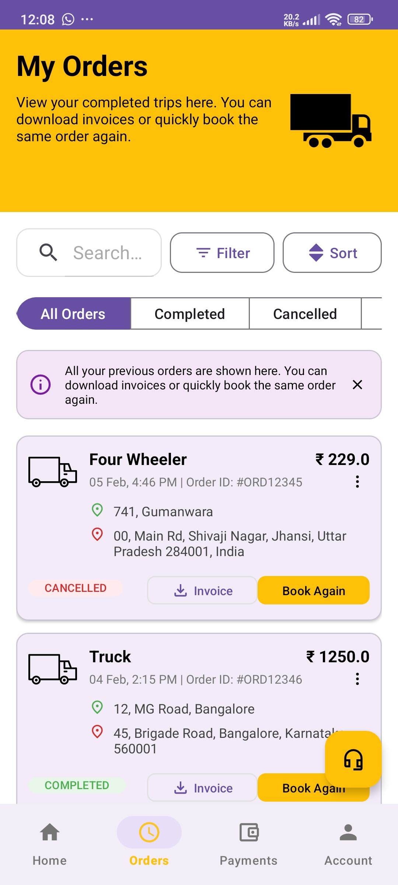
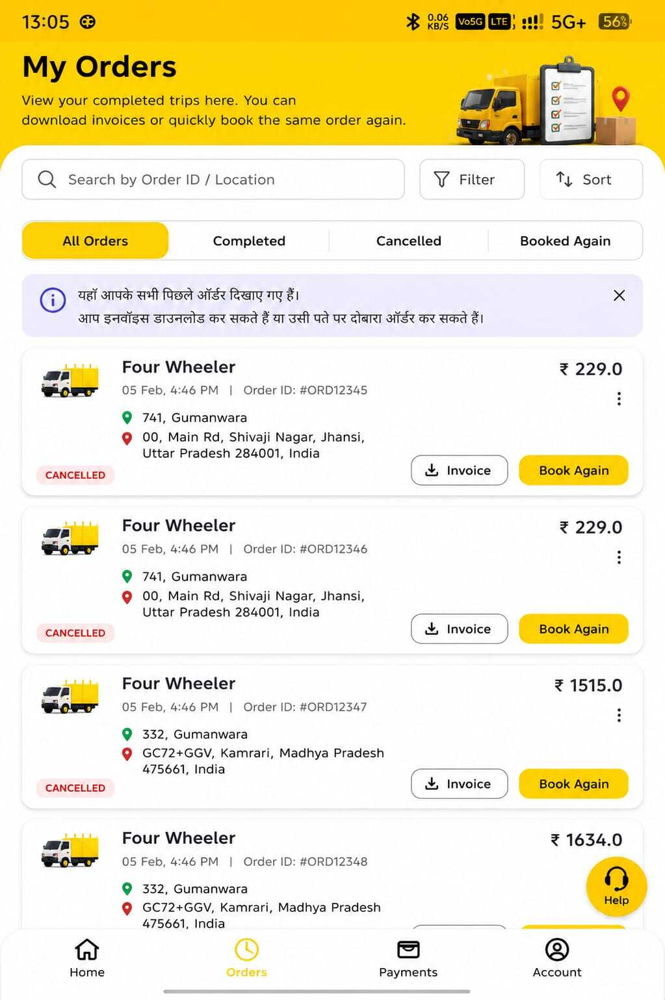

# OceanX - My Orders Screen

Android implementation of the "My Orders" UI from OceanX design specs. Built with Kotlin + Material 3.


## ✨ Features Implemented

- **RecyclerView** for order listing with custom adapter
- **Material 3 Components**: Cards, Chips, Buttons, Bottom Navigation
- **Responsive UI**: ConstraintLayout + ScrollView for all screen sizes
- **Interactive Elements**: Filter/Sort buttons, Help FAB, Bottom nav
- **Order Actions**: Invoice download, Book Again, More options
- **Status Chips**: Color-coded COMPLETED/CANCELLED states
- **Search UI**: SearchView with Order ID/Location hint

## 📱 Screenshots

| Current Design                                 | Proposed Design                               |
|------------------------------------------------|-----------------------------------------------|
|  |  |

## 🛠 Tech Stack

- **Language**: Kotlin
- **Min SDK**: 24 (Android 7.0)
- **UI**: Material 3, ConstraintLayout, RecyclerView
- **Architecture**: Activity + Adapter pattern
- **Dependencies**:
  ```gradle
  implementation 'com.google.android.material:material:1.12.0'
  implementation 'androidx.recyclerview:recyclerview:1.3.2'
  implementation 'androidx.constraintlayout:constraintlayout:2.1.4'
